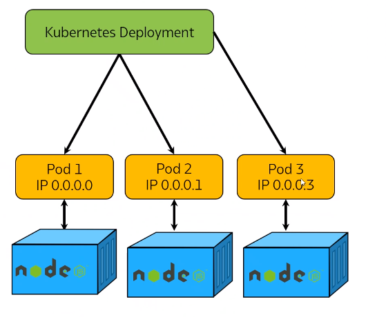

# Introduction to K8
## What is K8
- Large scale orchestration tool used to control a large number of containers
- Allows you to build in damage control options too (such as self healing)
- Open source

## Benefits
- Automated rollouts and rollbacks
- Self-healing: Automatically restarts containers when they fail
- Horizontal scaling: scales application up and down quickly either manually or automatically

## Why should we use


If you're used to tools like Docker containers but want to scale up from there then K8 is a good tool for that. It gives you methods to also group containers in sets, more robust scheduling tools with pods and you can also deploy nodes which can be used to submanage containers on your behalf

# Use cases
- Hybrid deployment: deploy and manage containers both locally on your own hardware as well as on off site hardware such as cloud services
- Big data: working with big data applications such as Hadoop for the processing of large amounts of data is easier with K8 thanks to it's horizontal scaling
- Machine learning: Dynamically allocate training jobs to machines with strong GPU performance

## When not to use
- Building serverless services with the function as a service platform is difficult with K8
- If you're not using containers (docker specifically). K8 doesn't perform so well in other settings
- Small scale operations that don't need learning a new piece of software like K8

## What are the competitors of K8
- Lambda
- Heroku
- Elastic Container Service

## What are managed services for K8
- A software offering maintained by a third-party provider but can be used by an application
- An example of this would be AWS EC2, Azure SQL database

## What is the difference between K8 managed service and non managed K8 services
- If you decide not to manage with K8 you will have to manage with your providers own tools
- This will mean having to learn a new set of tools for each provider or in some cases, building your own

## Diagram
⚠️Goes here

Ensure all ports are available that we will be using to deploy our app: `3000`, `80` and `27017`

### Task
- Create a K8 deployment file called `nginx-deployment.yml`
- Use default nginx docker image in our first iteration
- We will create 2 replicas of this deployment
- `kubectl create -f file-name.yml`

### K8 deployment with 2 replicas/pods
⬇️
```yaml
selector: nginx
```
⬇️

For your deployment to launch publicly we need create a `nginx_service.yml` to connect with deployment to see it working globally

### `LoadBalancer`
What is a load balancer?
## K8 commands
- `kubectl get [name of resource]`
  - `kubectl get avc`
  - `kubectl get node`
  - `kubectl get pods`
    - `kubectl describe pod`
- `kubectl delete deployments nginx-deployment `